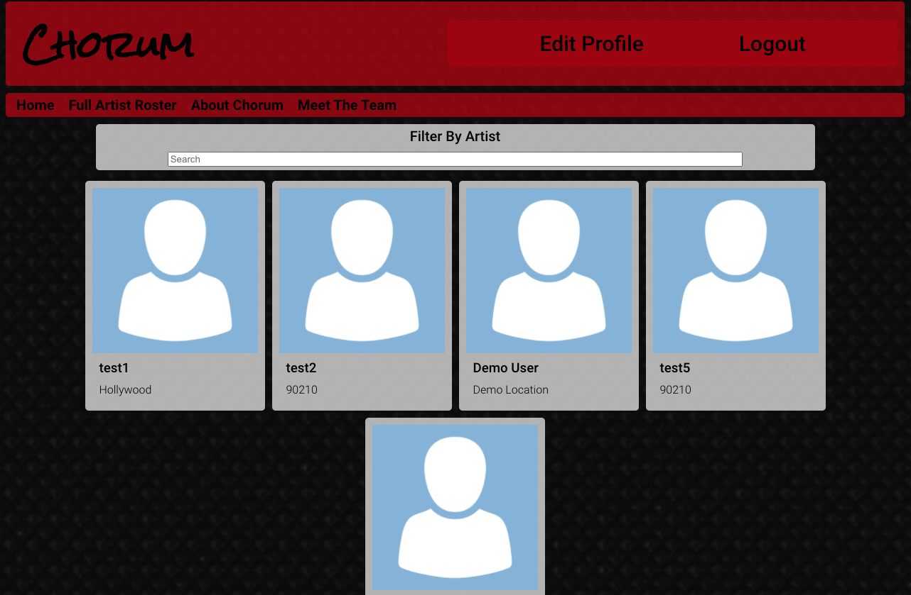

# Chorum

Programmed by **Victor Jarvis** for Thinkful's Software Engineering Immersion Program.

This program was created using HTML, CSS, Javascript, Node.js, and PostgreSQL.

Live Project Link: <https://chorum-app.vctrjrvs.vercel.app/>
Corresponding Server-Side Repo Link: <https://github.com/vctrjrvs/chorum-api>

## Screenshots

## Demo Info

Credentials 
Username: DemoUser 
Password: Password123!

---

Chorum is a wiki-style application that gives the power of control over information flow to musicians, rather than allowing multiple people to edit a page with whatever they want. Users that are musicians can sign up for an account, and add/edit various bits of information about themselves (Artist Name, Location, About, Associated Acts). Users who are not logged in may view any artist as well as a roster list of all of the artists signed up on the site.

This project was bootstrapped with [Create React App](https://github.com/facebook/create-react-app).
